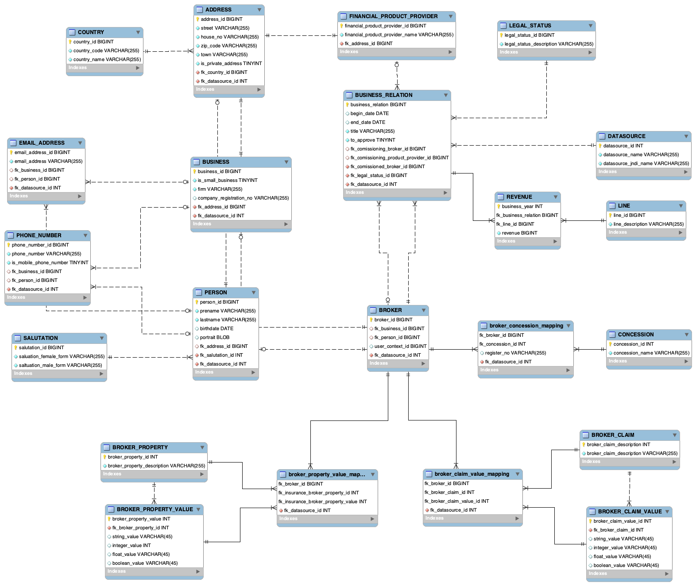

# Scraping-Demo

## ScrapingAPI

### Paket: de.kunz.scraping.api

A set of EJBs implementing a REST-API to control scrapping. 

### Paket: de.kunz.scraping.views

A set of POJOs wrapping entity beans to simplify the REST-API. 

### Paket: de.kunz.scraping.conf

CORS-configuration and path information.

## ScrapingEJB

### Overwiew

ScrapingEJB's EJBs architecture ist inspired by the pipe and filter architecture style. The system is mainly comprised by the following subsystems: 

* Sourcing
* Mapping
* Identification
* Reduction 
* Synchronization 

Sourcing implementes the communication with a variety of web resources providing information on insurance brokers and their business relations. Each insurance broker found is represented by an instance of a respective entitiy bean (Broker).  

Once created by the sourcing subsystem instances of Broker are asynchronously passed to the mapping subsytem, which performs datasource-specific cleaning and transformation operations.  

In practice, information on a particular insurance broker is scattered across a wide range of datasoruce. As pointed out above, each datatsource creates instances of Broker individually, which in turn might lead to a situation, in which 

* instances of broker representing the same physical entity must be matched,
* information must be beaggregated
* and conflicts must be resolved. 

These steps are mainly conducted by the reduction subsytem, whose implementation relies on the identification subsytem deciding whether to instances of Broker correspond to the same physical entity. 

Once reduction is completed, each insurance broker is represented by exactly on instance of Broker. Those instances are asynchronously passed to the synchronization subsystem whose task is to update the underlying database accordingly. 

In the following I would like to provide a more detailed overview over the most important packages.

### Packet: de.kunz.scraping.conf

Defines an API to read and modify subsystem-specific configuration. At moment the API is implemented based on XML and JAXB. At startup the configuration file is deserialized an translated into an object tree. Any changes to objects in that tree are immediately reflected in the configuration file to ensure persistence. 

### Packet: de.kunz.scraping.data.entity

A set of entity beans that are used as data transfer objects as well. 

### Packet: de.kunz.scraping.data.access

A set of EJBs encapsulating database access. 

### Packet: de.kunz.scraping.data.querying

Defines and impelements a generic API for querying objects implementing the interface IQueryable. Objects are either generated or retrieved by an instance of IDatasource. 

In order to start querying, the client has to get an instance of IQueryBuilder<T> where T is the type ob objects to be queried. A datasource is supposed to return only objects of a type T whiche meet those criteria expressed in terms of predicates and constraints on attribues. 
  
A predicate is collection of constraints and nested predicates linked by a single logical connective. An object of type T is to be returned if and only if the overall predicate specified for the query as a whole evaluates to true.
  
Formally, predicates implement the interface IPredicate<T> whereas attribute implement IAttribute<T>. Please note that the implementation of IAttribute<T> depends on the type T, as this implementation is reponsible for checking whether a given constraint is met by a given instance of T. 

Example: 
  
>final String constraintStr = zipCodeStr + "@" + zipCodeCountryCodeStr;  
>IQueryBuilder<Broker> queryBuilder =   
>  IQueryBuilder.getInstance(Broker.class).addDatasource(datasource).startPredicate(LogicalConnective.OR).addConstraint(new ZipCode(), constraintStr, Relation.EUQAL).closePredicate();  
>IQuery<Broker> brokerQuery = queryBuilder.getQuery();  

Web resources able to provide information on insurance brokers are represented as instances of IDatasource. In this particular use case T is Broker. 
    
### Packet: de.kunz.scraping.mapping 
  
The packet is reponsible for transforming attributes into standardized format. The implementation relies on a configurable chain of filters, where each filter performs one particular transformation on a single attribute. In contrast to de.kunz.scraping.sourcing.filtering these transformations are not datascource-specific.
 
This kind of preprocessing allows for smiplified matching as performed by de.kunz.scraping.identification.
 
### Packet: de.kunz.scraping.reduction

Stores preprocessed instances of Broker as a graph, where each node correponds to an instance. Instances are connected by an ede if and only if they represent the same physcical entity, which is decided by de.kunz.scraping.identification as outlined below. 

As a result of this definition, each  connected component corresponds to physical insurance broker. Once all instances have been integrated into the graph, a second phase starts, in which an instance of MeginEJBLocal iterates over all connected componets and creates for each an aggregated instnace of Broker. 
  
The result is passed to de.kunz.scraping.synchronization.
    
### Packet: de.kunz.scraping.identification 

The packet is concerned with the decision if two instances of Broker represent by the same physical entity. To determine whether two instances of Broker represent the same physcial entity, a client has to use the interface IdentityBeanLocalEJB. A respective instance must be retrieved by means of dependency injection. 
    
Internally, the passed instances are forwarded along a chain of filters, where each filter tries to match the instances based on different attributes, e.g. names, phone numbers, or email  addresses. If all filters fail in their attempt to match the instances, false is returned to the client, otherwise true is returned.   

### Packet: de.kunz.scraping.synchronization 
  
Reponsible for the synchroinization of incoming instances of Broker with the underlying database. Not implemented yet. 
  
### Packet: de.kunz.scraping.sourcing

The sourcing sub-system is comprised of the following packets
  
  * de.kunz.scraping.sourcing
  * de.kunz.scraping.sourcing.provider
  * de.kunz.scraping.sourcing.filtering 
  
As pointed out above, web resources providing information on insurance brokers correspond to instances of IDatasource. The respective clases implementing this interface are located in de.kunz.scraping.sourcing. 

The packet de.kunz.scraping.sourcing.provider defines and implements an API which allows for the extraction of relevant information from HTML and JSON documents based on datasource-specific configuration. 
  
de.kunz.scraping.sourcing.filtering is responsible for postprocessing. This is expecially relevant, if the relevant part of an HTML document can not be expressed in terms of CSS-Queries, e.g. a phone number embedded in continous text. Again, the implementation relies on datasource-specific configuration. 
  
## Database Schema

  

